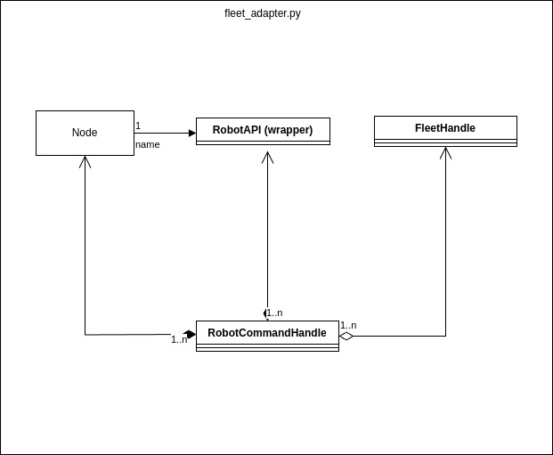

# Andino Fleet Adapter Package
An implementation of a Python-based full-control RMF fleet adapter for Andino fleet.
Please refer to https://github.com/open-rmf/fleet_adapter_template/tree/humble for implementation detail.

## Fleet Adapter Architecture
This package contains a main executable called fleet_adapter to create a node for enabling ROS-RMF communication and initialize robot fleet.
RobotClientAPI is implemented with our own Andino fleet manager to provide useful methods used by RobotCommandHandle. Each individual robot is controlled by RobotCommandHandle and is added to the fleet through FleetHandle.
```

## Configure Fleet Adapter
In order to add/remove a robot to this fleet, user can make change [config.yaml](https://github.com/ekumenlabs/andino_fleet_open_rmf/blob/main/andino_fleet_adapter/config.yaml) file under "robots" section.

## Usage
To run a fleet adapter, use the following command

```
ros2 launch andino_fleet_adapter andino_fleet_adapter.launch.py
```

