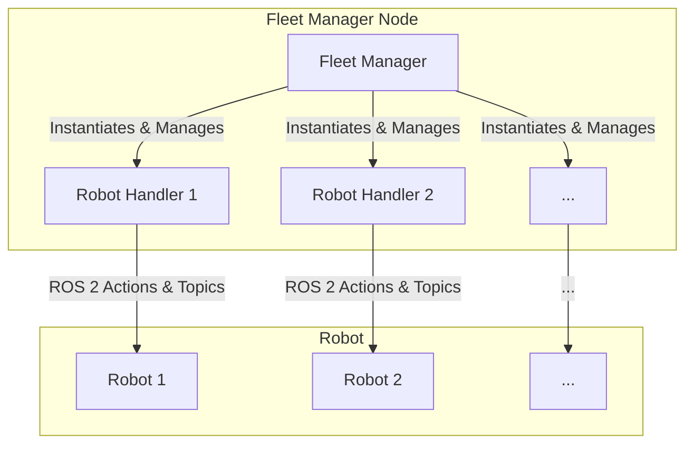
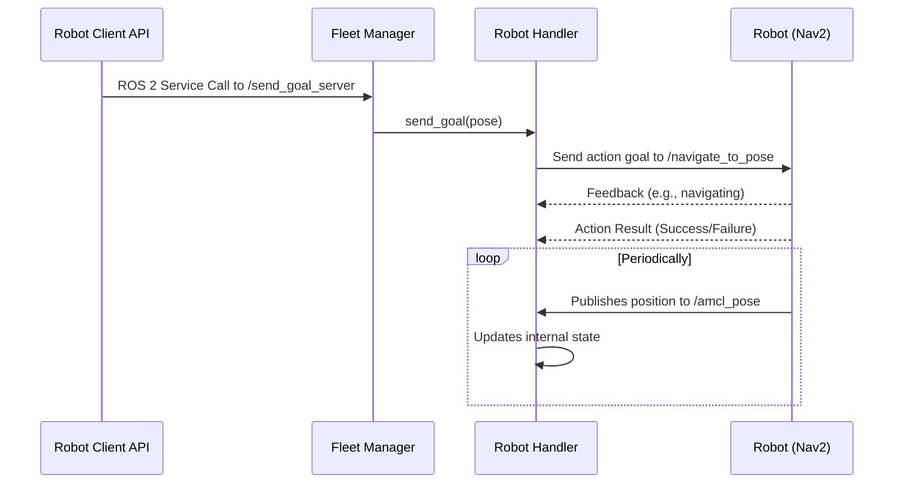

# Andino Fleet Manager

This document provides details on the configuration, inputs, and outputs of the Andino Fleet Manager.

## Configuration

The Fleet Manager is configured using a YAML file that specifies the initial pose of each robot in the fleet. An example of this file is `config/spawn_robots.yaml`.

## Inputs

The Fleet Manager receives commands from the Fleet Adapter via the following ROS 2 services:

*   `/send_goal_server`: To receive a navigation goal for a specific robot.
*   `/cancel_goal_server`: To receive a request to cancel a robot's current goal.
*   `/robot_pose_server`: To receive a request for the position of a specific robot.

## Outputs

The Fleet Manager produces the following outputs:

*   **Commands to Robots**: The Fleet Manager sends commands to individual robots using ROS 2 topics and actions. For example, for a robot named `andino1`, it uses the `/andino1/navigate_to_pose` action to send a navigation goal.
*   **Robot State Information**: The Fleet Manager provides robot state information to the Fleet Adapter in response to service calls.

---

## Robot Handler

The Robot Handler is an internal component of the Fleet Manager that manages a single robot in the fleet.

### Purpose

The Robot Handler is responsible for:

*   Managing the state of a single robot, including its position and navigation status.
*   Subscribing to the robot's pose updates.
*   Sending navigation goals to the robot and managing the goal lifecycle.

### Inputs

The Robot Handler receives commands from the Fleet Manager, such as requests to send a goal or cancel a goal.

### Outputs

The Robot Handler communicates with the robot using ROS 2 topics and actions. For a robot named `andino1`, it:

*   Subscribes to the `/andino1/amcl_pose` topic to receive pose updates.
*   Uses the `/andino1/navigate_to_pose` action to send navigation goals to the robot.

## Diagrams

### Object Interaction

This diagram shows the relationship between the Fleet Manager, the Robot Handlers and the robots.

### Navigation Task Sequence

This diagram illustrates the sequence of calls for a typical navigation task initiated by the Robot Client API.

