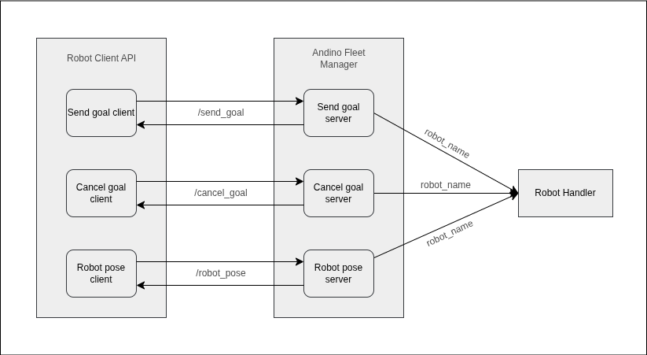
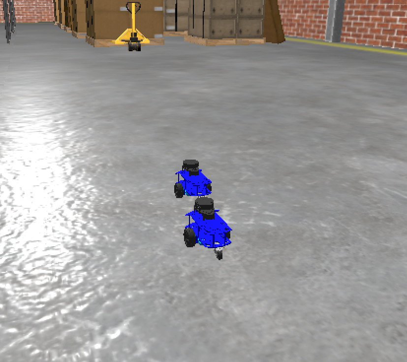

# Andino Fleet Manager Package
This package consists of the implementation of a fleet manager for Andino robots.

## Fleet Manager
### Summary

The goal of a fleet manager is to manage multiple robots so that it is able to send commands and receive information from each robot.

### Implementation
The manager is implemented as a ROS2 node that contains multiple services to control the andino fleet and monitor the robot states. These services include

- Sending a goal to the manager
- Canceling a current goal
- Reading a robot position

Each service requires a robot name in order to manage individual robots.



The fleet manager node has the following features implemented:

- Be able to implement relevant services to manage the andino fleet
- Use [custom service messages](../andino_fleet_msg/srv) for service interface
- Be able to get states of each robot

## Usage
To launch multiple robots with corresponding controller servers,

```
ros2 launch andino_fleet_manager spawn_multiple_robot.launch.py
```



*<b>Note: </b> To add/remove robot(s), edit <b>spawn_robots.yaml</b> under <b>[andino_fleet/config](https://github.com/ekumenlabs/andino_fleet_open_rmf/tree/main/andino_fleet/config)</b> folder. There are four robots by default.*

To run the implemented fleet manager,

```
ros2 run andino_fleet_manager fleet_manager
```

After the fleet manager node is running, it allows users to interact with the robot fleet as the following.

### Send a goal
Start moving a robot by sending a goal to the manager by specifying the robot name and the final pose,

```
ros2 service call /send_goal_server andino_fleet_msg/srv/SendGoal "{robot_name: 'andino2', final_pose: [0.1,0,0]}"
```

### Cancel a goal
Once a goal is being executed, users can cancel the goal given a robot name by,

```
ros2 service call /cancel_goal_server andino_fleet_msg/srv/CancelGoal "{robot_name: 'andino2'}"
```

### Request for current states
Users can retrieve a robot states as the following
- robot position defined by [x, y, yaw]
- robot connectivity
- navigation status

```
ros2 service call /robot_pose_server andino_fleet_msg/srv/RequestRobotPosition "{robot_name: 'andino2'}"
```
