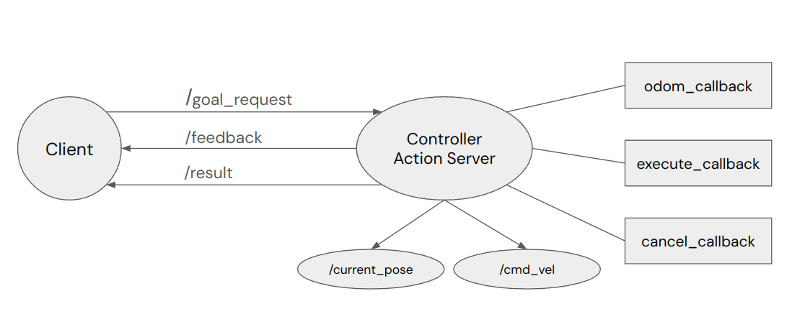

# Andino Fleet Package
This package consists of the implementation of a controller server and a fleet manager for Andino robots.

## Controller Server
### Summary

The goal of a controller server is to move an Andino robot from position A to B considering a feedback control loop. By specifying a goal position (x, y, yaw), the robot is able to move to that position. The theory behind this controller is obtained from *Introduction to Autonomous Mobile Robots by Roland Siegwart and Illah R. Nourbakhsh*

### Implementation
The controller is implemented as a ROS2 node that creates an action server for a specific andino bot. This action server takes clients requests that specify a Pose as it's goal, send the position information as the action feedback and returns True or False whether the bot arrived at the goal or not due to it's movement being completed or a goal being canceled.


In order for a controller to function properly, the following functionalities are implemented.

- Be able to process a goal request, feedback message, result response, and cancel goal request following [ROS2 action server design standard](https://design.ros2.org/articles/actions.html)
- Use [custom action message](https://github.com/ekumenlabs/andino_fleet_open_rmf/tree/main/controller_action_msg/action) for this controller


## Fleet Manager
### Summary

The goal of a fleet manager is to manage multiple robots so that it is able to send commands and receive information from each robot.

### Implementation
The manager is implemented as a ROS2 node that contains multiple services to control the andino fleet and monitor the robot states. These services include
- send a goal to the manager
- cancel a current goal
- read a robot position

Each service requires a robot name in order to manage individual robots.


The fleet manager node have the following features implemented.

- Be able to implement relevant services to manage the andino fleet
- Use [custom service messages](https://github.com/ekumenlabs/andino_fleet_open_rmf/tree/main/andino_fleet_msg/srv) for service interface
- Be able to get states of each robot

## Usage
To launch multiple robots with corresponding controller servers,

```bash
ros2 launch andino_rmf_gz spawn_multiple_robot.launch.py
```


*<b>Note: </b> To add/remove robot(s), edit <b>spawn_robots.yaml</b> under <b>[andino_rmf_gz/config](https://github.com/ekumenlabs/andino_fleet_open_rmf/tree/main/andino_rmf_gz/config)</b> folder. There are four robots by default.*

To run the implemented fleet manager,

```bash
ros2 launch andino_fleet_manager andino_fleet_manager.launch.py
```

## Local Development (Manual Service Interaction)

After the fleet manager node is running, it allows users to interact with the robot fleet through ROS 2 services. These examples can be used for development and testing purposes.

### Send a goal
Start moving a robot by sending a goal to the manager, specifying the robot name and the target pose [x, y, yaw].

```bash
ros2 service call /send_goal_service andino_fleet_msg/srv/SendGoal "{robot_name: 'andino2', final_pose: [0.1, 0.0, 0.0]}"
```

### Cancel a goal
Once a goal is being executed, users can cancel it by specifying the robot name.

```bash
ros2 service call /cancel_goal_service andino_fleet_msg/srv/CancelGoal "{robot_name: 'andino2'}"
```

### Request for current states
Users can retrieve a robot's current states, including its position [x, y, yaw], connectivity, and navigation status.

```bash
ros2 service call /robot_pose_service andino_fleet_msg/srv/RequestRobotPosition "{robot_name: 'andino2'}"
```
